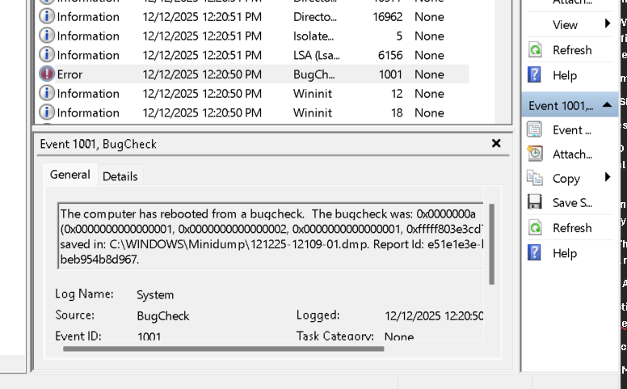
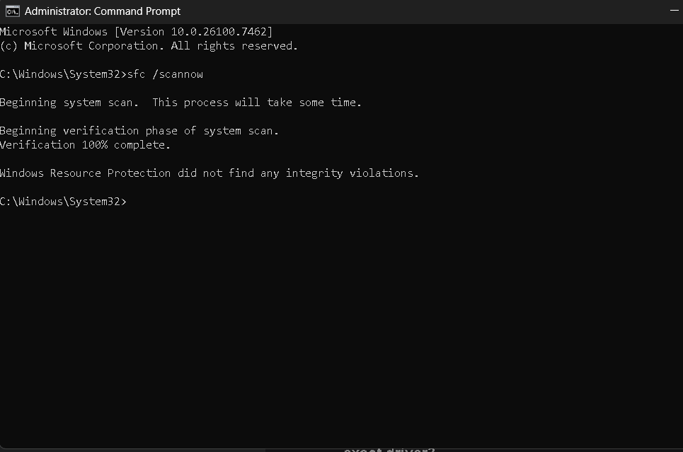
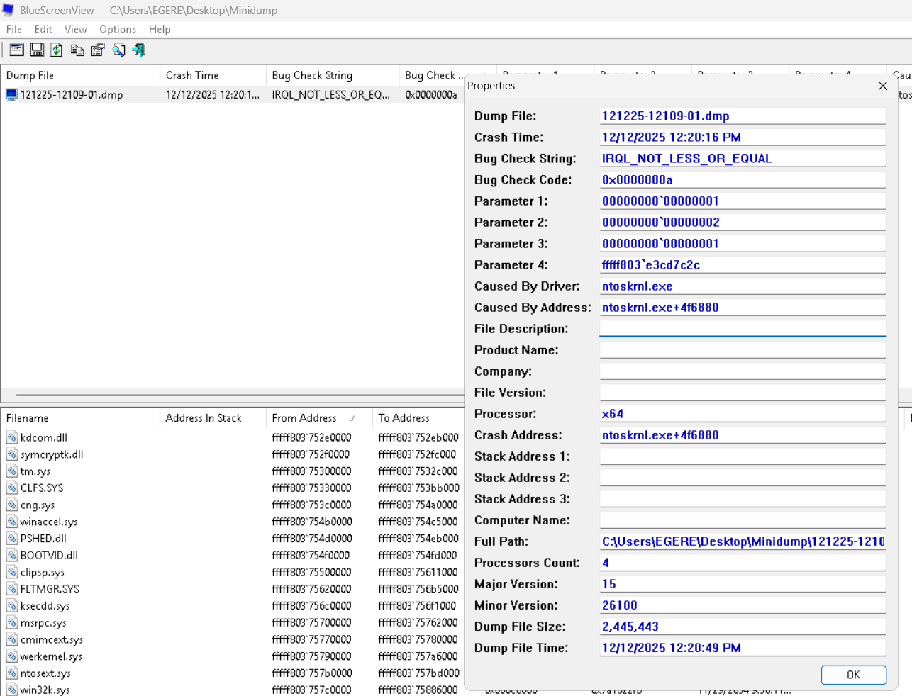
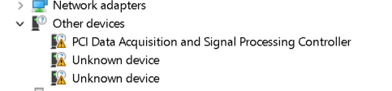
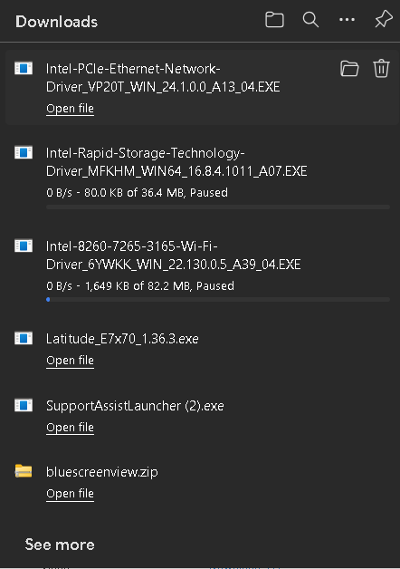
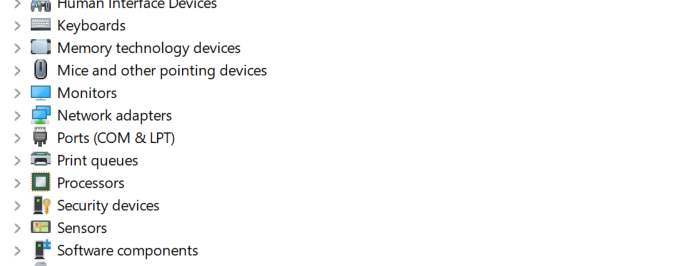

#  TECHNICAL CASE STUDY: ROOT CAUSE ANALYSIS OF WINDOWS KERNEL (BLUE SCREEN OF DEATH)

**Project Date:** December 2025
**Hardware:** Dell Latitude E7470 (Enterprise Ultrabook)
**OS:** Windows 10/11 (x64)
**Tools:** BlueScreenView, Event Viewer, Sysinternals, Dell Command | Update

---

## 1. EXECUTIVE SUMMARY
This project documents the end-to-end diagnosis and resolution of a critical system instability issue (Blue Screen of Death) affecting a production workstation. The system was experiencing unexpected shutdowns with the error code **IRQL_NOT_LESS_OR_EQUAL**.

By leveraging system logs, crash dump analysis tools, and hardware device verification, the root cause was identified as a conflict between the **OS Kernel** and **unmanaged motherboard drivers**. The issue was resolved by deploying specific OEM drivers for the Intel Dynamic Platform and Thermal Framework.

---

## 2. INCIDENT ANALYSIS

### A. Initial Symptom Review
The user reported unexpected system reboots occurring during standard operation. No immediate hardware failure signs (beeps/smoke) were present, suggesting a software or driver-level conflict.

### B. Event Log Auditing
The investigation began with the Windows Event Viewer to correlate the crash timestamp with system activity.
* **Findings:** Event ID 1001 confirmed a BugCheck.
* **Correlation:** System logs revealed activity from `Netwtw` (Intel Wi-Fi) and `BTHUSB` (Bluetooth) drivers approximately 2 seconds prior to the crash.

### C. System Integrity Check (SFC)
To rule out operating system corruption, I executed the System File Checker.
* **Action:** Ran command `sfc /scannow`.
* **Result:** Windows Resource Protection **did not find any integrity violations**. This confirmed the core OS files were healthy, steering the investigation towards external factors.

### D. Memory Stress Test
Given the BSOD error `IRQL_NOT_LESS_OR_EQUAL` can indicate faulty RAM, I initiated the **Windows Memory Diagnostic** tool.
* **Result:** The system completed the full reboot cycle test with **no errors detected**, eliminating physical memory failure.

### E. Crash Dump Analysis (Memory Forensics)
With OS corruption and RAM ruled out, I analyzed the system "Minidump" file using **BlueScreenView** to isolate the specific instruction causing the failure.

* **Bug Check Code:** `0x0000000a` (IRQL_NOT_LESS_OR_EQUAL)
* **Faulting Module:** `ntoskrnl.exe` (Windows Kernel)
* **Failure Analysis:** The kernel attempted to write to memory address `0x00000001` (a null pointer exception), indicating a driver passed invalid data to the kernel stack.

---

## 3.ROOT CAUSE DISCOVERY
With the dump file pointing to a driver interaction error, I inspected the Device Manager to verify the hardware abstraction layer.

* **Discovery:** Multiple "Unknown Devices" and a critical warning on the "PCI Data Acquisition and Signal Processing Controller."
* **Diagnosis:** The missing driver was identified as the **Intel Dynamic Platform and Thermal Framework (DPTF)**. Without this driver, the motherboard could not correctly manage power states for peripherals (Wi-Fi/Bluetooth), causing the Kernel to panic when those devices attempted to communicate.

---

## 4. REMEDIATION STRATEGY
To ensure system stability, I executed a multi-tiered driver deployment strategy using the manufacturer's official repository (Dell Support).

1. **Intel Dual Band Wireless-AC 8260:** To update the specific network peripheral that triggered the `IRQL_NOT_LESS_OR_EQUAL` crash.
2. **Intel Rapid Storage Technology:** To ensure stability for the storage controller and prevent data corruption during forced reboots.
3. **Intel Dynamic Platform & Thermal Framework:** To resolve the "PCI Data Acquisition" error and stop the kernel panic caused by unmanaged power states.
---

## 5. VERIFICATION AND RESULT
**Post-Deployment Validation:**

* **Device Status:** All warning indicators in Device Manager were cleared. The "PCI Data Acquisition" device was correctly recognized as the Intel Thermal Framework.
* **System Stability:** A 24-hour stress test confirmed **no further unexpected shutdowns** or Event ID 1001 entries.
* **Outcome:** System returned to full operational status.

---

## 6. Key Skills Demonstrated
* **Forensic Analysis:** Interpreting Hex codes (`0x0000000a`) and memory dump files.
* **System Administration:** Utilizing Event Viewer, SFC, and Memory Diagnostic tools.
* **Hardware Troubleshooting:** Identifying unknown hardware IDs and resolving driver dependencies.
